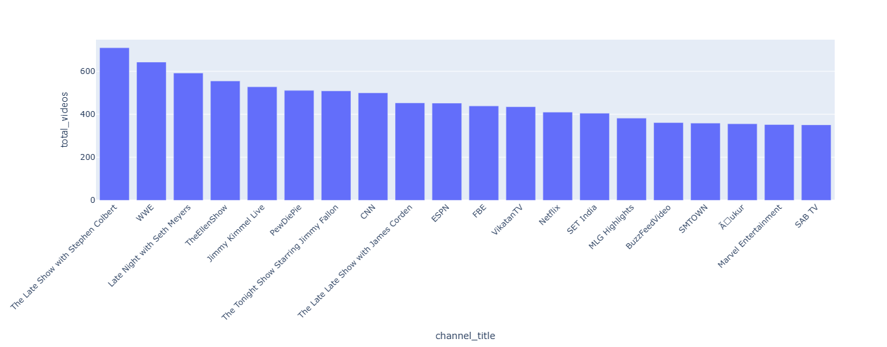
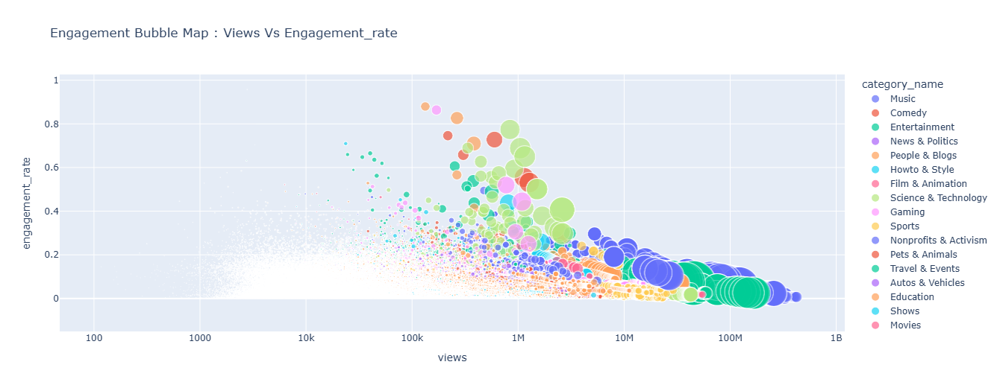
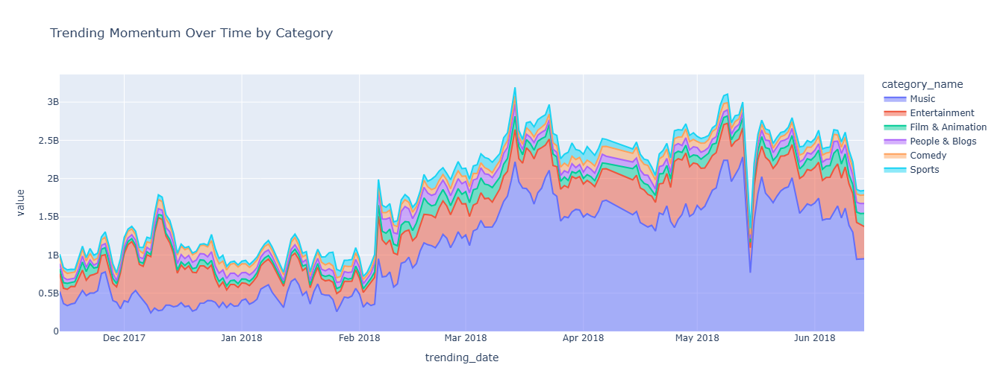

<h1 align="center">YouTube Data Analysis</h1>
<p align="center">
  
  
  
  
</p>

<p align="center">
  
</p>

<p align="center">
  An end-to-end data analysis project exploring YouTube trending videos, engagement patterns, and content performance.
</p>

## Overview :

This project analyzes YouTube trending video data to uncover insights about views, likes, comments, and content categories. The goal is to understand what makes videos trend and identify patterns across different regions.

## Objectives :

- Perform data cleaning and preprocessing
- Analyze trends in views, likes, and comments
- Identify top-performing categories
- Visualize insights using graphs and charts

## Project Structure :

```id="b7u2qk"
youtube-data-analysis/
│
├── notebooks/
│   └── youtube_data_analysis.ipynb
│
├── outputs/
│   ├── audience_engagement_by_category.png
│   ├── category_attention_share.png
│   ├── engagement_bubble_map.png
│   ├── top_channels_trending_videos.png
│   └── top6_trending_momentum.png
│
├── README.md
├── requirements.txt
└── LICENSE
```

## Dataset :
The dataset is not included in this repository due to its large size.

**Download Dataset:** https://drive.google.com/drive/folders/1OV597CngPKDa-HQPc8JRSHCnnT1ttmAk?usp=sharing


## Sample Outputs :


### Top Channels by Number of Trending Videos:



This visualization shows the top YouTube channels with the highest number of trending videos, highlighting the most dominant and frequently trending creators on the platform.

---

### Audience Engagement by Category:


This visualization shows how different YouTube categories perform in terms of audience engagement.

---

### Category Attention Share with Engagement Efficiency:


This chart highlights how attention is distributed across categories along with engagement efficiency.

---

### Engagement Bubble Map (Views vs Engagement Rate):



This bubble chart represents the relationship between video views and engagement rate across categories.

---

### Trending Momentum Over Time (Top 6 Categories):

<p align="center">
  
</p>

This visualization focuses on the top 6 YouTube categories with the highest total views, showing how their trending momentum evolves over time. It provides a clearer comparison of dominant categories and highlights fluctuations in popularity across different time periods.


---

## Key Insights :

* Categories like Music and Entertainment consistently have the highest number of trending videos, showing their strong popularity among viewers.
* Videos with more likes and comments are more likely to trend, indicating that audience engagement plays a major role.
* Some channels appear frequently in trending lists, which suggests they have a loyal audience and consistent content strategy.
* Trends are not constant, certain categories gain popularity at different times, showing changing viewer interests over time.

---

## Challenges Faced :

* Working with a large dataset was difficult and required careful handling to avoid performance issues.
* Some visualizations were hard to interpret at first due to long labels and clutter, so adjustments were needed.
* Choosing the right type of graph for each analysis was challenging but important to clearly present insights.


